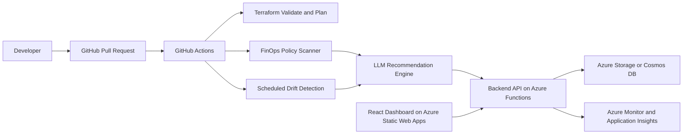

# CloudWise Radar

CloudWise Radar is an Azure-native, LLM-guided FinOps and architecture drift radar. It helps engineering teams catch wasteful cloud changes, missing cost governance, and Terraform drift before they become production problems.

## Problem

Teams often ship infrastructure quickly but lose control over cost and configuration:

- Developers over-provision Azure resources.
- Required cost tags are missed.
- Manual portal changes create Terraform drift.
- Pull requests do not explain the financial or operational impact of infrastructure changes.

## Solution

CloudWise Radar will scan Terraform, Azure resources, and deployment history to produce:

- FinOps policy findings.
- Terraform drift findings.
- AI-generated explanations.
- Suggested Terraform fixes.
- GitHub Actions checks and scheduled drift reports.
- A dashboard for cost, drift, and remediation status.

## Milestone 1 Scope

This first milestone creates the Azure-ready foundation:

- Repository structure.
- Terraform provider configuration.
- Azure resource group definition.
- Required FinOps tags.
- Terraform validation workflow.
- FinOps policy rules.
- Architecture documentation.

## Target Architecture



## Local Prerequisites

Install these tools before running the project locally:

- Git
- GitHub CLI
- Azure CLI
- Terraform
- Node.js
- Python
- Docker Desktop
- VS Code

## First Local Commands

```bash
git init
terraform -chdir=infra/envs/dev init
terraform -chdir=infra/envs/dev fmt
terraform -chdir=infra/envs/dev validate
```

## Naming Convention

Use this project name everywhere:

```text
cloudwise-radar
```

Recommended Azure resource group name:

```text
rg-cloudwise-radar-dev
```

Recommended Azure region:

```text
eastus
```

## Learning Roadmap

1. Git and GitHub repository setup.
2. Terraform basics with Azure.
3. GitHub Actions validation.
4. Azure OIDC login from GitHub.
5. Basic Azure infrastructure deployment.
6. Drift detection workflow.
7. FinOps policy scanner.
8. Backend API.
9. AI recommendation engine.
10. React dashboard.
11. Monitoring and alerts.
12. Documentation and demo.

