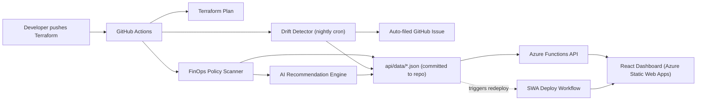

# CloudWise Radar — Project Documentation

## 1. The Problem

Teams running infrastructure-as-code on Azure run into three recurring failures that usually aren't caught until they're expensive:

1. **Cost and policy violations get approved by accident.** A PR adds an oversized VM SKU, skips a required tag, or deploys to the wrong region — and unless a senior engineer manually reviews every Terraform diff, it merges and starts costing money or breaking compliance.
2. **Infrastructure drifts silently.** Someone changes a resource directly in the Azure Portal (a "quick fix" tag, a manual scale-up) and Terraform's state file no longer matches reality. Nobody notices until `terraform apply` tries to "fix" something that was never broken, or until an audit asks why production doesn't match the IaC repo.
3. **Junior engineers can't self-serve fixes.** Even when a violation is caught, the error message is a raw policy ID or a Terraform diff. Someone without FinOps/Azure pricing context doesn't know whether it's safe to fix, or how.

These aren't hypothetical — they're the standard failure modes that tools like Infracost, driftctl, and Microsoft's own FinOps Toolkit exist to solve.

## 2. What CloudWise Radar Does

CloudWise Radar is an automated pipeline that runs on every push and on a nightly schedule:

1. **Scans Terraform code** against a policy-as-code ruleset (`policies/finops-rules.yaml`) — required tags, blocked SKUs, allowed regions, budget ceilings.
2. **Detects drift** between Terraform state and live Azure resources using `terraform plan -detailed-exitcode`, on a nightly cron.
3. **Generates AI-assisted recommendations** — converts a raw policy violation into a plain-English explanation and a concrete Terraform fix (falls back to a rule-based engine if no LLM key is configured, so it degrades gracefully).
4. **Files a GitHub issue automatically** when drift is detected, with a link to the failing run.
5. **Publishes results to a live dashboard** — a React + TypeScript frontend backed by a serverless Python API (Azure Functions behind Azure Static Web Apps), with zero manual redeploy steps.
6. **Authenticates to Azure with zero stored secrets** — GitHub Actions OIDC (`azure/login@v2`), not long-lived service principal passwords.

## 3. Architecture

**Why data is committed to the repo instead of a database:** this keeps the project's storage layer free-tier and dependency-free for a learning/portfolio project, while still proving the full "scan → publish → serve → render" data flow. The architecture diagram's original `Cosmos DB` slot is filled by git-committed JSON for now; swapping in Cosmos DB later only requires changing `function_app.py`'s read layer, not the pipeline.

## 4. Tech Stack

| Layer | Technology | Why |
|---|---|---|
| IaC | Terraform | Industry-standard, declarative, drift-detectable |
| Cloud | Azure | Resource Group, Static Web Apps, Functions |
| CI/CD | GitHub Actions | Native to where the code lives, free for public repos |
| Backend | Python (Azure Functions) | Serverless, consumption-tier, no servers to manage |
| Frontend | React + TypeScript + Vite | Fast dev loop, type safety, small bundle |
| Auth | GitHub OIDC → Azure | No stored secrets, short-lived federated tokens |
| AI | OpenAI-compatible API, with rule-based fallback | Works with or without an API key configured |

## 5. Real Engineering Challenges Faced (and how they were debugged)

These are the two most interview-worthy issues from this project — both were silent failures (workflow showed green ✅, but the feature didn't actually work), which is a harder class of bug than a failing CI run.

### Challenge 1 — Drift detection never actually fired

**Symptom:** The `Terraform plan drift check` step ran, the workflow showed all green, but `Create issue when drift is detected` was always skipped — even when I manually created real drift on a live Azure resource (`az group update --tags ...`) and confirmed locally that `terraform plan -detailed-exitcode` returned exit code `2`.

**Root cause:** `hashicorp/setup-terraform@v3` wraps the `terraform` binary by default (`terraform_wrapper: true`) so it can capture stdout/stderr into step outputs for the Actions UI. The wrapper has a documented side effect: **it always returns exit code 0 to the shell**, regardless of Terraform's actual exit code. The condition I'd written (`if: steps.plan.outcome == 'failure'`) can structurally never be true under the wrapper — `outcome` reflects the masked exit code, not the real one.

**Fix:** Use `steps.plan.outputs.exitcode` instead, which the wrapper exposes separately as a step output containing the *real* exit code (`0`/`1`/`2`). Changed the condition to `steps.plan.outputs.exitcode == '1' || steps.plan.outputs.exitcode == '2'`.

**How I verified the fix, not just trusted it:** created real drift on a live resource group via Azure CLI, confirmed locally Terraform saw it (`Plan: 0 to add, 1 to change, 0 to destroy`), ran the workflow before and after the fix, and confirmed a GitHub issue and a populated `drift-findings.json` only appeared after the fix — then reverted the manual change and re-ran to confirm it cleared back to clean.

**Why this matters for an organization:** a monitoring/detection system that silently never fires is worse than no system at all — it gives false confidence. This is exactly the class of bug that passes code review (the YAML *looks* reasonable) but fails in production, and it's why I insist on testing the actual failure path, not just the happy path.

### Challenge 2 — The dashboard never updated after a scan found something

**Symptom:** The FinOps scanner and drift detector both successfully committed updated JSON data to the repo (`api/data/*.json`), but the live dashboard kept showing stale/empty data. Re-running the scan didn't help.

**Root cause:** GitHub deliberately does not trigger downstream workflows from commits authored by the default `GITHUB_TOKEN` — this is intentional anti-infinite-loop protection. Since the data-publishing commit was made by the bot identity using `GITHUB_TOKEN`, it silently failed to trigger the Static Web Apps deploy workflow, even though a human pushing the identical commit *would* trigger it (which is what made this so confusing — manual pushes worked fine in earlier testing, masking the issue).

**Fix:** Added `workflow_dispatch` as a trigger on the SWA deploy workflow (it only had `push`/`pull_request` before), gave the scanning workflows `actions: write` permission, and added an explicit `gh workflow run "Azure Static Web Apps CI/CD"` step that fires only when the bot's commit step actually changed something.

**How I verified it:** created real drift, watched the drift workflow commit data, confirmed via `gh run list` that the SWA deploy workflow was *not* triggered (the smoking gun), implemented the fix, re-ran the same scenario, and this time watched the SWA deploy auto-trigger and confirmed via `curl` against the live API that `drift_count` updated with zero manual steps.

**Why this matters for an organization:** automation that requires a human to "remember to redeploy" isn't automation — it's a manual step with extra YAML. This is a common gotcha in any GitOps-style pipeline where a bot commits config/data back to the same repo it's reading from, and it's worth knowing before building anything that relies on bot-authored commits cascading.

## 6. Organizational / Business Value

- **Shifts cost governance left.** Violations are caught in CI before `terraform apply`, not discovered on next month's Azure bill.
- **Cuts MTTD for drift** from "whenever someone happens to notice" to "within one nightly run, with an auto-filed issue and owner-visible dashboard entry."
- **Reduces senior-engineer review load.** Policy enforcement is encoded in YAML, not tribal knowledge re-explained on every PR.
- **Produces an audit trail for free** — every finding and drift event is a timestamped, git-committed JSON record plus a GitHub issue, useful for compliance and FinOps reporting without extra tooling.
- **Lowers the skill floor for remediation.** A junior engineer gets a plain-English explanation and a concrete fix instead of a raw policy ID.
- **No secret-rotation burden.** OIDC means there's no Azure service principal password sitting in GitHub Secrets waiting to be leaked or expire.

## 7. How to Validate It End-to-End

See the validation checklist run during development — summarized here for anyone picking up this repo:

1. `terraform plan` in `infra/envs/dev` shows no drift against real Azure.
2. `python scripts/finops_scan.py` catches a deliberately introduced policy violation (e.g. a blocked SKU string), then clears after reverting.
3. `python scripts/ai_recommend.py` produces a plain-English fix for any finding.
4. The deployed API (`/api/health`, `/findings`, `/recommendations`, `/drift`, `/summary`) returns correct, consistent data.
5. The dashboard renders the same data the API returns.
6. A push to `main` runs the FinOps scan, publishes data, and the dashboard auto-redeploys with no manual step.
7. Creating real drift on a live Azure resource (e.g. `az group update --tags ...`) results in: a GitHub issue, an updated `drift-findings.json`, an auto-triggered redeploy, and a live API/dashboard reflecting the change — and reverting it clears all of the above back to clean.
8. `grep -r "client-secret" .github/workflows/` returns nothing — confirms OIDC-only Azure auth.
