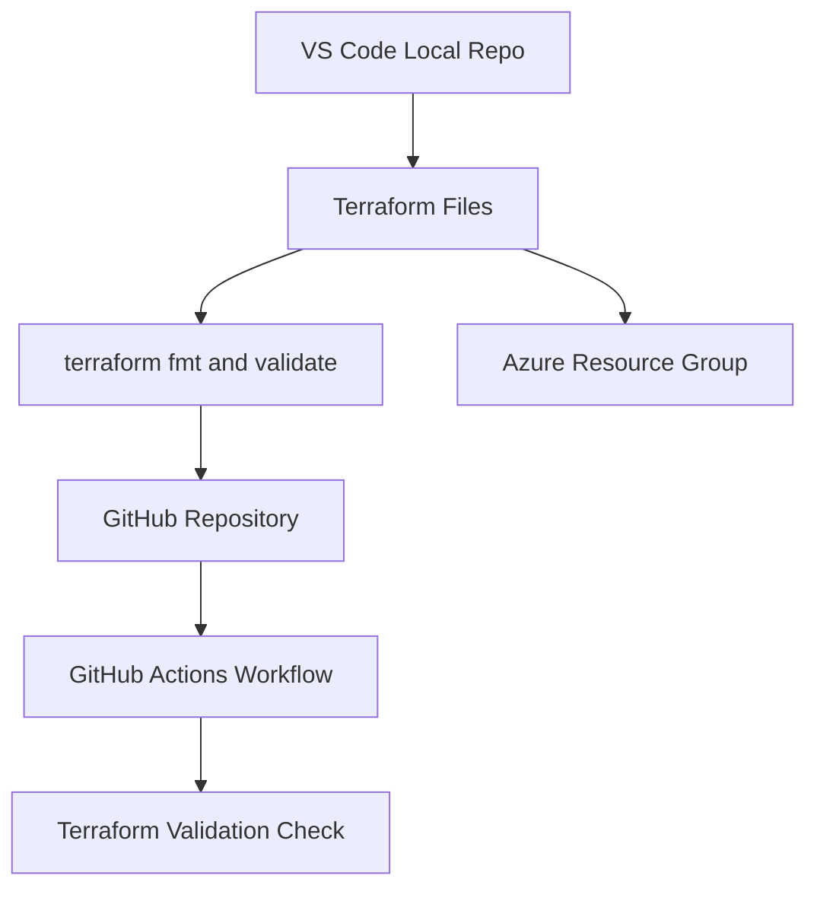
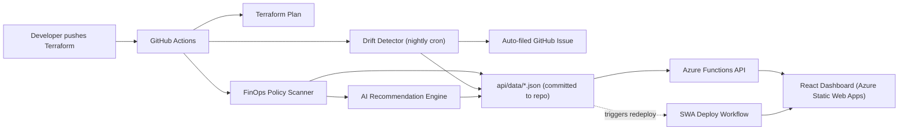

# CloudWise Radar Architecture

## Goal

CloudWise Radar is designed as an industry-style DevOps project that combines Azure, Terraform, CI/CD, FinOps, drift detection, observability, and AI-assisted remediation.

## Core Components

| Component | Purpose |
| --- | --- |
| Terraform | Provisions Azure infrastructure as code. |
| GitHub Actions | Runs CI/CD, Terraform validation, deployment, and scheduled drift checks. |
| Azure Resource Group | First Azure boundary for all dev resources. |
| FinOps Policy Rules | Defines required tags, blocked SKUs, and cost governance rules. |
| Backend API | Azure Functions (Python) serving findings, recommendations, drift, and summary endpoints. |
| AI Recommendation Engine | Converts raw findings into explanations and Terraform fix suggestions (LLM with rule-based fallback). |
| React Dashboard | Displays cost findings, drift findings, and AI recommendations, backed by the live API. |
| Azure Monitor | Not yet implemented — planned for a future milestone. |

## Milestone 1 Architecture

## Current Architecture

See [PROJECT.md](PROJECT.md) for the full write-up, including the real bugs found while wiring this end-to-end.

## Data Flow

1. A developer opens a pull request with Terraform changes.
2. GitHub Actions runs Terraform formatting, validation, and the FinOps policy scan.
3. On push to `main`, scan results are published to `api/data/` and committed.
4. Drift detection runs nightly (and on demand) against live Azure infrastructure, writing `drift-findings.json` and filing a GitHub issue if drift is found.
5. Either data-publishing workflow explicitly triggers the Static Web Apps deploy workflow when it commits a real change (bot-authored commits don't auto-trigger other workflows on GitHub, so this step is required).
6. The Azure Functions API serves the committed JSON via `/findings`, `/recommendations`, `/drift`, and `/summary`.
7. The React dashboard renders findings, drift status, and AI-generated remediation guidance from the live API.

## DevOps Concepts Covered

- Source control.
- Branching and pull requests.
- Infrastructure as Code.
- CI/CD.
- GitHub Actions.
- Azure OIDC authentication.
- Secret management.
- Policy as code.
- Drift detection.
- Scheduled jobs.
- Observability.
- Cloud cost governance.
- AI-assisted operations.

