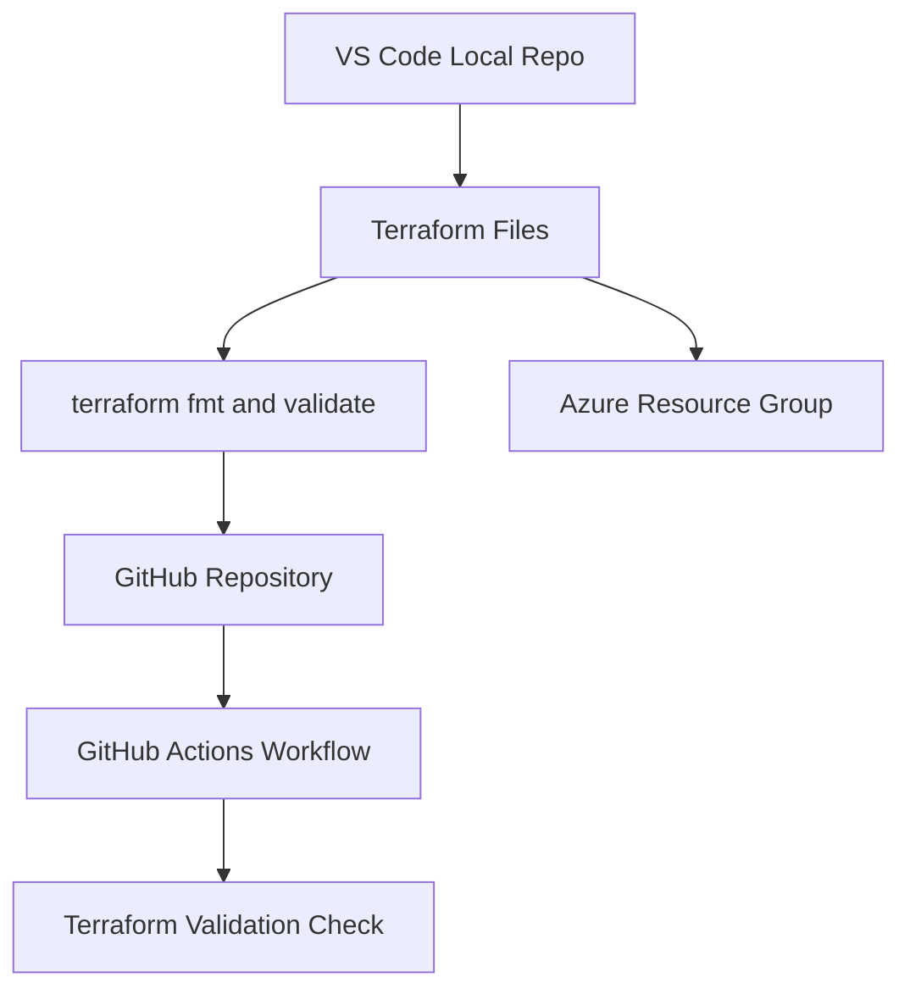
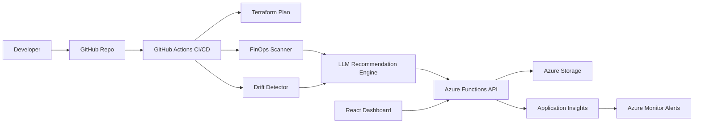

# CloudWise Radar Architecture

## Goal

CloudWise Radar is designed as an industry-style DevOps project that combines Azure, Terraform, CI/CD, FinOps, drift detection, observability, and AI-assisted remediation.

## Core Components

| Component | Purpose |
| --- | --- |
| Terraform | Provisions Azure infrastructure as code. |
| GitHub Actions | Runs CI/CD, Terraform validation, deployment, and scheduled drift checks. |
| Azure Resource Group | First Azure boundary for all dev resources. |
| FinOps Policy Rules | Defines required tags, blocked SKUs, and cost governance rules. |
| Backend API | Will store scan results and expose dashboard APIs. |
| AI Recommendation Engine | Will convert raw findings into explanations and Terraform fix suggestions. |
| React Dashboard | Will display cost, drift, risk, and remediation status. |
| Azure Monitor | Will collect logs, metrics, traces, and alerts. |

## Milestone 1 Architecture

## Final Architecture

## Data Flow

1. A developer opens a pull request with Terraform changes.
2. GitHub Actions runs Terraform formatting and validation.
3. Later milestones add cost and policy scanning.
4. Drift detection runs on a schedule against live Azure infrastructure.
5. Findings are sent to the backend.
6. The AI recommendation engine explains the issue and proposes a fix.
7. The dashboard shows findings, severity, estimated savings, and remediation status.

## DevOps Concepts Covered

- Source control.
- Branching and pull requests.
- Infrastructure as Code.
- CI/CD.
- GitHub Actions.
- Azure OIDC authentication.
- Secret management.
- Policy as code.
- Drift detection.
- Scheduled jobs.
- Observability.
- Cloud cost governance.
- AI-assisted operations.

